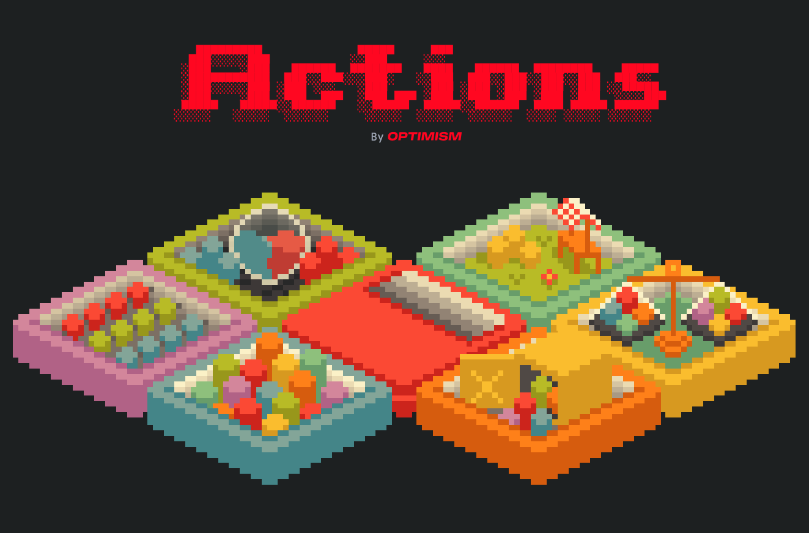

# Actions SDK



> ⚠️ This is a developer preview! Actions is not yet ready for production use.

[Actions SDK](https://actions.optimism.io) and [demo app](https://actions.optimism.io/earn) by [Optimism](https://optimism.io).

## Adding Actions to your app

- [Quickstart](https://docs.optimism.io/app-developers/quickstarts/actions)
- [Integrating Wallets](https://docs.optimism.io/app-developers/reference/actions/integrating-wallets)
- [Wallet Functions](https://docs.optimism.io/app-developers/reference/actions/wallet-definitions)
- [Lend Functions](https://docs.optimism.io/app-developers/reference/actions/lend-documentation)

## Structure

This monorepo contains the following packages:

- [`packages/sdk`](./packages/sdk) - The core Actions SDK - A Typescript library of lightweight abstractions for building onchain.

- [`packages/demo/frontend`](./packages/demo/frontend) - A React+vite splash page + [demo](https://actions.optimism.io/earn) app displaying supported wallets and DeFi protocols.

- [`packages/demo/backend`](./packages/demo/backend) - A hono service demonstrating the Actions SDK in a backend environment.

- [`packages/demo/contracts`](./packages/demo/contracts) - Demo smart contracts including a Faucet contract and a [Morpho market deployment script](./packages/demo/contracts/README.md#deploymorphomarkets-sol) for setting up lending markets on testnets.

## Demo

### Setup

1.  **Install dependencies**

```bash
pnpm install
```

2. **Add env vars**

   Copy all example environment files to create local configuration:

   ```bash
   cp packages/demo/backend/.env.example packages/demo/backend/.env
   cp packages/demo/frontend/.env.example packages/demo/frontend/.env
   ```

3. **Configure Providers**
   1. Sign up for a wallet provider and add secrets. Note that certain provider support both back and frontend signing.

   ```bash
   # Edit packages/demo/backend/.env
   PRIVY_APP_ID=your_privy_app_id_here
   PRIVY_APP_SECRET=your_privy_app_secret_here
   ```

   2. For gas sponsorship, sign up for a bundler. For this demo we use [Pimlico](https://docs.pimlico.io/references/permissionless/tutorial/tutorial-1).

   The remaining environment variables are pre-configured for local development.

### Quick Start (Recommended)

While each component of the repo can be run independently, start the complete demo environment in one command:

```bash
pnpm dev
```

This uses `mprocs` to orchestrate multiple processes:

- **Backend**: Starts the Actions SDK backend service
- **Frontend**: Starts the React web application

The demo will be available at `http://localhost:5173` once all services are running.

## Contributing

No contribution is too small and all contributions are valued.
Thanks for your help improving the project! We are so happy to have you!

You can read our contribution guide [here](./CONTRIBUTING.md) to understand better how we work in the repo.

## License

© 2025 Actions by Optimism. All other files within this repository are licensed under the [MIT License](https://github.com/ethereum-optimism/actions/blob/main/LICENSE) unless stated otherwise.

## Disclaimer

This software is provided "as is," without warranty of any kind, express or implied, including but not limited to the warranties of merchantability, fitness for a particular purpose, and noninfringement. In no event shall the authors or copyright holders be liable for any claim, damages, or other liability, whether in an action of contract, tort, or otherwise, arising from, out of, or in connection with the software.

You are responsible for any regulatory implications related to your activities as it pertains to the software, including compliance with any law, rule or regulation (collectively, "Law"), including without limitation, any applicable economic sanctions Laws, export control Laws, securities Laws, anti-money laundering Laws, or privacy Laws. By using this software, you are subject to Optimism's full [Terms of Service](https://www.optimism.io/terms) and the [Optimism Community Agreement](https://www.optimism.io/community-agreement).
