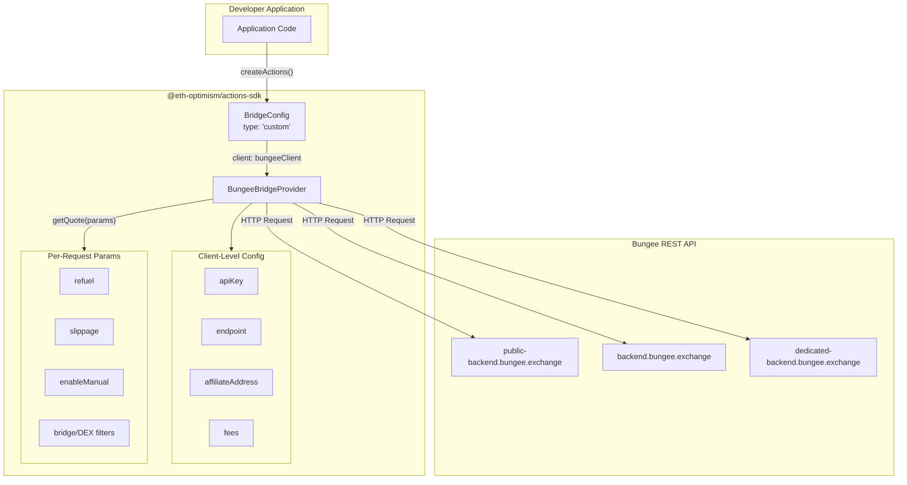
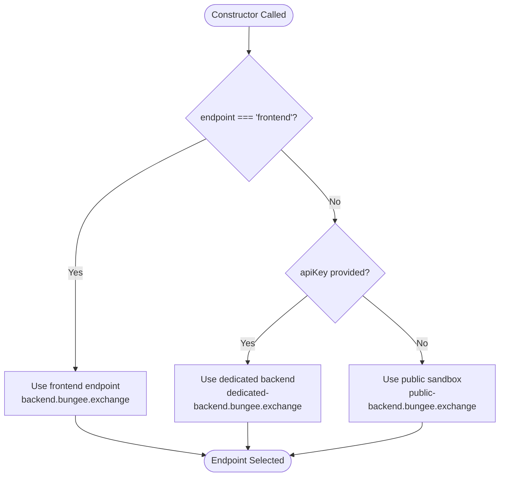
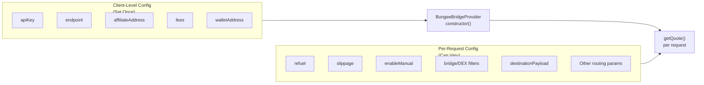
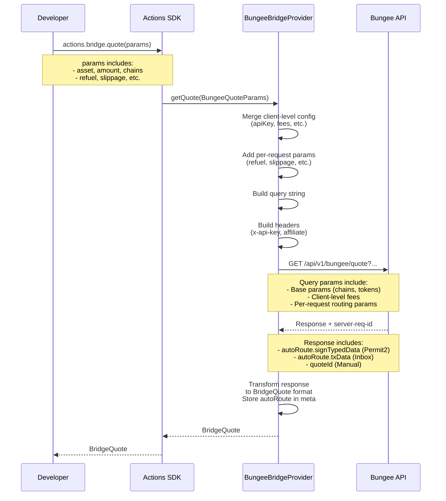
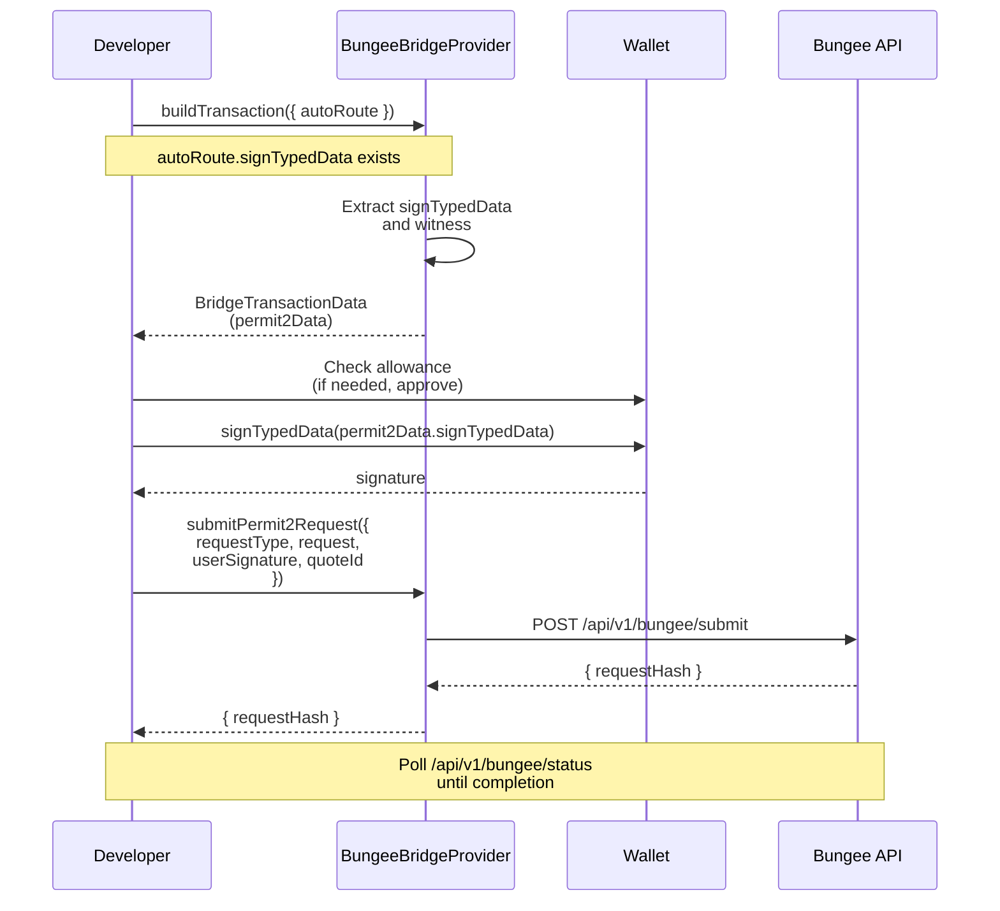
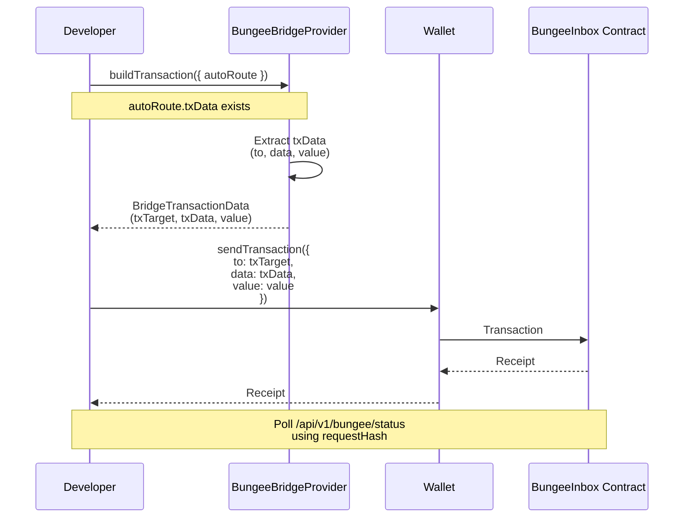
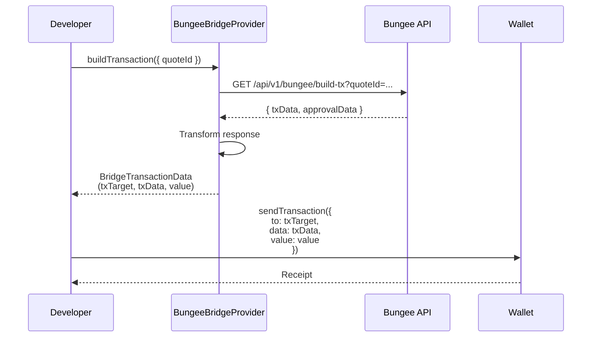

# Bungee Bridge Provider Implementation

### Key Design Principles

1. **Works out-of-the-box**: Default to public sandbox endpoint (no API key required)
2. **Optional API key**: When provided, use dedicated backend endpoint with higher rate limits
3. **Per-request configuration**: Routing parameters (refuel, slippage, etc.) configured per quote request, not per client
4. **Spec-compliant**: Uses existing `type: 'custom'` pattern - no new bridge type needed
5. **Built-in**: No separate package needed - `BungeeBridgeProvider` exported from Actions SDK
6. **Flexible**: Can change refuel, slippage, routing preferences per request

### Architecture



### Endpoint Selection Logic

Based on [Bungee API documentation](https://docs.bungee.exchange/bungee-api/get-api-access):

| Configuration | Endpoint | Auth | Rate Limit | Use Case |
|--------------|----------|------|------------|----------|
| No config (default) | `https://public-backend.bungee.exchange` | None | Very Limited | Testing/Development |
| `endpoint: 'frontend'` | `https://backend.bungee.exchange` | Domain/IP whitelist | 100 RPM per IP | Frontend/dApp (whitelisted) |
| `apiKey` provided | `https://dedicated-backend.bungee.exchange` | `x-api-key` header | 20 RPS (extendable) | Production backend |

**Endpoint Selection Priority:**

1. If `endpoint: 'frontend'` explicitly set → use frontend endpoint
2. If `apiKey` provided → use dedicated backend endpoint
3. Otherwise → use public sandbox endpoint (default)



### Implementation Details

#### 1. BridgeConfig Type

**No changes needed** - Uses existing `BridgeConfig` interface from spec:

```typescript
interface BridgeConfig {
  /** Bridge provider type (defaults to 'native') */
  type?: 'native' | 'custom'
  
  /** Custom bridge client instance (required if type === 'custom') */
  client?: BridgeClient
  
  /** Provider-specific configuration */
  config?: {
    maxFeePercent?: number
    routeAllowlist?: BridgeRouteConfig[]
    routeBlocklist?: BridgeRouteConfig[]
  }
}
```

Bungee is integrated via `type: 'custom'` with `client: new BungeeBridgeProvider(...)`.

#### 2. BungeeBridgeProvider Implementation

**Location:** `packages/actions-sdk/src/bridge/providers/BungeeBridgeProvider.ts`

**Export:** Export `BungeeBridgeProvider`, `BungeeConfig`, and `BungeeQuoteParams` from Actions SDK.

```typescript
import { BridgeClient, BridgeQuoteParams, BridgeQuote, BridgeTransactionData, BridgeRoute } from '../types'

// Client-level configuration (set once at instantiation)
export interface BungeeConfig {
  /** Optional API key - when provided, uses dedicated backend */
  apiKey?: string
  /** Optional affiliate address for tracking purposes */
  affiliateAddress?: string
  /** Optional endpoint selection - 'public' (default), 'frontend', or 'dedicated' */
  endpoint?: 'public' | 'frontend' | 'dedicated'
  /** Optional fee configuration - requires both feeTakerAddress and feeBps */
  fees?: {
    /** Address that will receive collected fees */
    feeTakerAddress: string
    /** Fee percentage in basis points (1 basis point = 0.01%, e.g., 50 = 0.5%) */
    feeBps: number
  }
  /** Wallet address context (for userAddress in API calls) */
  walletAddress?: string
}

// Per-request configuration (can vary per quote)
export interface BungeeQuoteParams extends BridgeQuoteParams {
  /** Optional swap slippage percentage (e.g., 0.5 for 0.5%) */
  slippage?: number
  /** Optional: Enable manual route selection */
  enableManual?: boolean
  /** Optional: Disable swapping for manual routes */
  disableSwapping?: boolean
  /** Optional: Disable auto routes */
  disableAuto?: boolean
  
  /** Optional: Bridge names to exclude (for manual routes) */
  excludeBridges?: string[]
  /** Optional: Bridge names to include (for manual routes) */
  includeBridges?: string[]
  /** Optional: DEX names to exclude (for manual routes) */
  excludeDexes?: string[]
  /** Optional: DEX names to include (for manual routes) */
  includeDexes?: string[]
  
  /** Optional: Enable gas refuel on destination chain */
  refuel?: boolean
  /** Optional: Delegate address (defaults to userAddress) */
  delegateAddress?: string
  /** Optional: Payload to execute on destination */
  destinationPayload?: string
  /** Optional: Gas limit for destination payload execution */
  destinationGasLimit?: string
  /** Optional: Refund address for auto routes */
  refundAddress?: string
  /** Optional: Use inbox for auto routes */
  useInbox?: boolean
  /** Optional: Enable multiple auto routes with different optimizations */
  enableMultipleAutoRoutes?: boolean
}

export class BungeeBridgeProvider implements BridgeClient {
  private apiKey?: string
  private affiliateAddress?: string
  private feeTakerAddress?: string
  private feeBps?: number
  private walletAddress?: string
  private baseURL: string

  constructor(config: BungeeConfig = {}) {
    this.apiKey = config.apiKey
    this.affiliateAddress = config.affiliateAddress
    this.feeTakerAddress = config.fees?.feeTakerAddress
    this.feeBps = config.fees?.feeBps
    this.walletAddress = config.walletAddress
    
    // Validate fee configuration - both must be provided if fees are enabled
    if (config.fees && (!config.fees.feeTakerAddress || config.fees.feeBps === undefined)) {
      throw new Error('Bungee fee configuration requires both feeTakerAddress and feeBps')
    }
    
    // Select endpoint based on explicit endpoint setting or API key presence
    if (config.endpoint === 'frontend') {
      this.baseURL = 'https://backend.bungee.exchange'
    } else if (config.endpoint === 'dedicated' || config.apiKey) {
      this.baseURL = 'https://dedicated-backend.bungee.exchange'
    } else {
      // Default to public sandbox
      this.baseURL = 'https://public-backend.bungee.exchange'
    }
  }

  async getQuote(params: BungeeQuoteParams): Promise<BridgeQuote> {
    const { asset, amount, fromChainId, toChainId, to } = params

    // Build base query parameters
    // Validated against Swagger: https://public-backend.bungee.exchange/swagger-json
    const queryParams: Record<string, string> = {
      userAddress: this.walletAddress || to || '',
      originChainId: fromChainId.toString(),
      destinationChainId: toChainId.toString(),
      inputToken: getAssetAddress(asset, fromChainId),
      outputToken: getAssetAddress(asset, toChainId),
      inputAmount: parseUnits(amount, asset.decimals).toString(),
      receiverAddress: to || this.walletAddress || '',
    }

    // Add client-level fee parameters if configured
    if (this.feeTakerAddress && this.feeBps !== undefined) {
      queryParams.feeTakerAddress = this.feeTakerAddress
      queryParams.feeBps = this.feeBps.toString()
    }

    // Add per-request routing configuration
    if (params.slippage !== undefined) {
      queryParams.slippage = params.slippage.toString()
    }
    if (params.enableManual !== undefined) {
      queryParams.enableManual = params.enableManual.toString()
    }
    if (params.disableSwapping !== undefined) {
      queryParams.disableSwapping = params.disableSwapping.toString()
    }
    if (params.disableAuto !== undefined) {
      queryParams.disableAuto = params.disableAuto.toString()
    }

    // Add bridge/DEX filtering (for manual routes)
    if (params.excludeBridges && params.excludeBridges.length > 0) {
      params.excludeBridges.forEach(bridge => {
        queryParams.excludeBridges = bridge  // API accepts multiple with same key
      })
    }
    if (params.includeBridges && params.includeBridges.length > 0) {
      params.includeBridges.forEach(bridge => {
        queryParams.includeBridges = bridge
      })
    }
    if (params.excludeDexes && params.excludeDexes.length > 0) {
      params.excludeDexes.forEach(dex => {
        queryParams.excludeDexes = dex
      })
    }
    if (params.includeDexes && params.includeDexes.length > 0) {
      params.includeDexes.forEach(dex => {
        queryParams.includeDexes = dex
      })
    }

    // Add advanced features
    if (params.refuel !== undefined) {
      queryParams.refuel = params.refuel.toString()
    }
    if (params.delegateAddress) {
      queryParams.delegateAddress = params.delegateAddress
    }
    if (params.destinationPayload) {
      queryParams.destinationPayload = params.destinationPayload
    }
    if (params.destinationGasLimit) {
      queryParams.destinationGasLimit = params.destinationGasLimit
    }
    if (params.refundAddress) {
      queryParams.refundAddress = params.refundAddress
    }
    if (params.useInbox !== undefined) {
      queryParams.useInbox = params.useInbox.toString()
    }
    if (params.enableMultipleAutoRoutes !== undefined) {
      queryParams.enableMultipleAutoRoutes = params.enableMultipleAutoRoutes.toString()
    }

    // Build headers
    const headers: Record<string, string> = {}
    if (this.apiKey) {
      headers['x-api-key'] = this.apiKey
    }
    if (this.affiliateAddress) {
      headers['affiliate'] = this.affiliateAddress
    }

    const searchParams = new URLSearchParams(queryParams)
    
    if (params.excludeBridges) params.excludeBridges.forEach(b => searchParams.append('excludeBridges', b))
    if (params.includeBridges) params.includeBridges.forEach(b => searchParams.append('includeBridges', b))
    if (params.excludeDexes) params.excludeDexes.forEach(d => searchParams.append('excludeDexes', d))
    if (params.includeDexes) params.includeDexes.forEach(d => searchParams.append('includeDexes', d))

    const response = await fetch(
      `${this.baseURL}/api/v1/bungee/quote?${searchParams}`,
      { headers }
    )

    const data = await response.json()
    const serverReqId = response.headers.get('server-req-id')

    if (!data.success) {
      throw new BridgeQuoteError(
        `Bungee quote error: ${data.statusCode}: ${data.message}. server-req-id: ${serverReqId}`
      )
    }

    return transformQuoteResponse(data.result)
  }

  async buildTransaction(params: { 
    quoteId?: string
    autoRoute?: BungeeAutoRoute  // From quote response for auto routes
  }): Promise<BridgeTransactionData> {
    let autoRoute: BungeeAutoRoute | undefined = params.autoRoute

    // Permit2 flow: signTypedData exists (auto ERC20 with gasless approvals)
    if (autoRoute?.signTypedData) {
      const witness = autoRoute.signTypedData.values?.witness || autoRoute.userOp
      return {
        permit2Data: {
          signTypedData: autoRoute.signTypedData,
          witness: witness,
          requestType: autoRoute.requestType,
          quoteId: autoRoute.quoteId,
        },
        requestHash: autoRoute.requestHash,
        approvalData: autoRoute.approvalData ? {
          approvalTokenAddress: autoRoute.approvalData.tokenAddress,
          allowanceTarget: autoRoute.approvalData.spenderAddress === '0'
            ? '0x000000000022D473030F116dDEE9F6B43aC78BA3' // Permit2 default
            : autoRoute.approvalData.spenderAddress,
          approvalAmount: autoRoute.approvalData.amount,
        } : undefined,
      }
    }

    // Inbox flow: txData exists (native tokens or ERC20 with useInbox: true)
    if (autoRoute?.txData) {
      return {
        txTarget: autoRoute.txData.to,
        txData: autoRoute.txData.data,
        value: autoRoute.txData.value,
        requestHash: autoRoute.requestHash,
        approvalData: autoRoute.approvalData ? {
          approvalTokenAddress: autoRoute.approvalData.tokenAddress,
          allowanceTarget: autoRoute.approvalData.spenderAddress,
          approvalAmount: autoRoute.approvalData.amount,
        } : undefined,
      }
    }

    // Fallback: Manual route via build-tx endpoint
    if (params.quoteId) {
      const headers: Record<string, string> = {}
      if (this.apiKey) {
        headers['x-api-key'] = this.apiKey
      }

      const response = await fetch(
        `${this.baseURL}/api/v1/bungee/build-tx?quoteId=${params.quoteId}`,
        { headers }
      )

      const data = await response.json()
      const serverReqId = response.headers.get('server-req-id')

      if (!data.success) {
        throw new BridgeBuildError(
          `Bungee build-tx error: ${data.statusCode}: ${data.message}. server-req-id: ${serverReqId}`
        )
      }

      return transformBuildTxResponse(data.result)
    }

    throw new Error('Either quoteId or autoRoute must be provided')
  }

  async submitPermit2Request(params: {
    requestType: string
    request: any  // witness object
    userSignature: string
    quoteId: string
  }): Promise<{ requestHash: string }> {
    const headers: Record<string, string> = {
      'Content-Type': 'application/json',
    }
    if (this.apiKey) {
      headers['x-api-key'] = this.apiKey
    }

    const response = await fetch(
      `${this.baseURL}/api/v1/bungee/submit`,
      {
        method: 'POST',
        headers,
        body: JSON.stringify({
          requestType: params.requestType,
          request: params.request,
          userSignature: params.userSignature,
          quoteId: params.quoteId,
        }),
      }
    )

    const data = await response.json()
    const serverReqId = response.headers.get('server-req-id')

    if (!data.success) {
      throw new BridgeBuildError(
        `Bungee submit error: ${data.error?.message || 'Unknown error'}. server-req-id: ${serverReqId}`
      )
    }

    return { requestHash: data.result.requestHash }
  }

  async getSupportedRoutes(): Promise<BridgeRoute[]> {
    const headers: Record<string, string> = {}
    if (this.apiKey) {
      headers['x-api-key'] = this.apiKey
    }
    if (this.affiliateAddress) {
      headers['affiliate'] = this.affiliateAddress
    }

    const response = await fetch(
      `${this.baseURL}/api/v1/supported-chains`,
      { headers }
    )

    const data = await response.json()
    const serverReqId = response.headers.get('server-req-id')

    if (!data.success) {
      throw new BridgeError(
        `Bungee supported-chains error: ${data.statusCode}: ${data.message}. server-req-id: ${serverReqId}`
      )
    }

    return transformSupportedRoutesResponse(data.result)
  }
}
```

#### 3. Developer Usage Examples

**Basic usage (no API key):**

```typescript
import { createActions, BungeeBridgeProvider } from '@eth-optimism/actions-sdk'

const bungeeClient = new BungeeBridgeProvider({
  // No API key - uses public sandbox endpoint by default
})

const actions = createActions({
  wallet: { /* ... */ },
  chains: [
    { chainId: 8453, rpcUrl: '...' },
    { chainId: 10, rpcUrl: '...' },
  ],
  bridge: {
    type: 'custom',
    client: bungeeClient,
  },
})

// Basic quote without per-request config
const quote = await actions.bridge.quote({
  asset: USDC,
  amount: 100,
  fromChainId: 8453,
  toChainId: 10,
})
```

**With per-request refuel:**

```typescript
const bungeeClient = new BungeeBridgeProvider({
  apiKey: process.env.BUNGEE_API_KEY,
})

// Quote with refuel enabled
const quoteWithRefuel = await actions.bridge.quote({
  asset: USDC,
  amount: 100,
  fromChainId: 8453,
  toChainId: 10,
  refuel: true,  // Per-request: enable gas refuel
})

// Quote without refuel (same client, different config)
const quoteWithoutRefuel = await actions.bridge.quote({
  asset: USDC,
  amount: 100,
  fromChainId: 8453,
  toChainId: 10,
  refuel: false,  // Per-request: disable refuel
})
```

**With slippage, manual routing and dex filtering:**

```typescript
const bungeeClient = new BungeeBridgeProvider({
  apiKey: process.env.BUNGEE_API_KEY,
})

// Quote with custom slippage and manual routing
const quote = await actions.bridge.quote({
  asset: USDC,
  amount: 100,
  fromChainId: 8453,
  toChainId: 10,
  slippage: 0.5,  // Per-request: 0.5% slippage
  enableManual: true,  // Per-request: enable manual routes
  includeBridges: ['across', 'stargate-v2'],  // Per-request: filter bridges
  excludeDexes: ['zeroxv2'],  // Per-request: exclude DEX
})
```

**With fee charging (client-level):**

```typescript
const bungeeClient = new BungeeBridgeProvider({
  apiKey: process.env.BUNGEE_API_KEY,
  fees: {
    feeTakerAddress: '0xYourFeeCollectionAddress',
    feeBps: 50,  // 0.5% fee
  },
})

// All quotes from this client will include fees
const quote = await actions.bridge.quote({
  asset: USDC,
  amount: 100,
  fromChainId: 8453,
  toChainId: 10,
  refuel: true,  // Per-request: can still configure refuel per request
})
```

**Permit2 flow (auto ERC20 with gasless approvals):**

```typescript
const bungeeClient = new BungeeBridgeProvider({
  apiKey: process.env.BUNGEE_API_KEY,
})

// Get quote for ERC20 token (auto route with Permit2)
const quote = await actions.bridge.quote({
  asset: USDC,
  amount: 100,
  fromChainId: 8453,
  toChainId: 10,
})

// Build transaction returns Permit2 signature data
const txData = await bungeeClient.buildTransaction({ 
  autoRoute: quote.meta.autoRoute 
})

// Check and approve token if needed (before signing)
if (txData.approvalData) {
  // Check allowance and approve if needed
  // See Bungee docs for approval handling
}

// Sign the Permit2 typed data
const signature = await wallet.signTypedData(txData.permit2Data.signTypedData)

// Submit signed Permit2 request
const result = await bungeeClient.submitPermit2Request({
  requestType: txData.permit2Data.requestType,
  request: txData.permit2Data.witness,
  userSignature: signature,
  quoteId: txData.permit2Data.quoteId,
})

console.log('Request hash:', result.requestHash)
// Poll status using /api/v1/bungee/status?requestHash=...
```

**Inbox flow (native tokens or ERC20 with useInbox: true):**

```typescript
const bungeeClient = new BungeeBridgeProvider({
  apiKey: process.env.BUNGEE_API_KEY,
})

// Get quote for native token (or ERC20 with useInbox: true)
const quote = await actions.bridge.quote({
  asset: ETH,  // Native token uses 0xEeeeeEeeeEeEeeEeEeEeeEEEeeeeEeeeeeeeEEeE
  amount: 0.1,
  fromChainId: 8453,
  toChainId: 10,
  // Or for ERC20 with inbox:
  // useInbox: true,
})

// Build transaction returns inbox contract transaction data
const txData = await bungeeClient.buildTransaction({ 
  autoRoute: quote.meta.autoRoute 
})

// Send transaction directly to inbox contract
const receipt = await wallet.sendTransaction({
  to: txData.txTarget,
  data: txData.txData,
  value: txData.value,
})

console.log('Transaction hash:', receipt.transactionHash)
console.log('Request hash:', txData.requestHash)
// Poll status using /api/v1/bungee/status?requestHash=...
```

**Manual route flow (existing behavior):**

```typescript
const bungeeClient = new BungeeBridgeProvider({
  apiKey: process.env.BUNGEE_API_KEY,
})

// Get quote with manual routes enabled
const quote = await actions.bridge.quote({
  asset: USDC,
  amount: 100,
  fromChainId: 8453,
  toChainId: 10,
  enableManual: true,
})

// Build transaction using quoteId (calls /api/v1/bungee/build-tx)
const txData = await bungeeClient.buildTransaction({ 
  quoteId: quote.meta.quoteId 
})

// Send transaction
const receipt = await wallet.sendTransaction({
  to: txData.txTarget,
  data: txData.txData,
  value: txData.value,
})
```

### Key Advantages

1. **Zero-configuration**: Works immediately without API key (like `@socket.tech/bungee`)
2. **Production-ready**: Optional API key unlocks dedicated backend with higher limits
3. **Per-request flexibility**: Change refuel, slippage, routing preferences per quote request
4. **Spec-compliant**: Uses existing `type: 'custom'` pattern - no spec changes needed
5. **Built-in**: No separate package installation needed - `BungeeBridgeProvider` exported from Actions SDK
6. **Flexible**: Can switch between public/frontend/dedicated endpoints via config
7. **Consistent**: Follows same pattern as any other custom bridge provider

### Configuration Separation



**Client-level (set once):**

- `apiKey` - API authentication
- `endpoint` - Endpoint selection
- `affiliateAddress` - Tracking
- `fees` - Fee collection (optional)
- `walletAddress` - Default user address

**Per-request (can vary):**

- `refuel` - Gas refuel on destination
- `slippage` - Swap slippage tolerance
- `enableManual` - Manual route selection
- `disableSwapping` / `disableAuto` - Route type control
- `excludeBridges` / `includeBridges` - Bridge filtering
- `excludeDexes` / `includeDexes` - DEX filtering
- `delegateAddress` - Delegate address
- `destinationPayload` / `destinationGasLimit` - Destination execution
- `refundAddress` - Refund address
- `useInbox` - Inbox usage
- `enableMultipleAutoRoutes` - Multiple route optimization

### API Mapping

- `getQuote()` → `/api/v1/bungee/quote`
- `buildTransaction()` → Route-specific:
  - **Permit2 (auto ERC20)**: Uses `autoRoute.signTypedData` from quote response (no API call)
  - **Inbox (native/ERC20 with useInbox)**: Uses `autoRoute.txData` from quote response (no API call)
  - **Manual routes**: `/api/v1/bungee/build-tx` endpoint
- `submitPermit2Request()` → `/api/v1/bungee/submit` (for Permit2 signature submission)
- `getSupportedRoutes()` → `/api/v1/supported-chains`

**Key differences:**

- Endpoint base URL selected automatically (public/frontend/dedicated) based on config
- Headers only include `x-api-key` and `affiliate` when provided
- Per-request parameters added to query string when specified
- Error messages include `server-req-id` for debugging
- Frontend endpoint requires domain/IP whitelisting with Bungee

### Quote Request Flow



### Transaction Building Flows

#### Permit2 Flow (Auto ERC20)



#### Inbox Flow (Native Token)



#### Manual Route Flow



### Implementation Tasks

1. Create `BungeeBridgeProvider` class implementing `BridgeClient` interface
2. Create `BungeeQuoteParams` interface extending `BridgeQuoteParams` with per-request parameters
3. Export `BungeeBridgeProvider`, `BungeeConfig`, and `BungeeQuoteParams` from Actions SDK
4. Implement endpoint selection logic (public/frontend/dedicated based on config and API key)
5. Implement per-request parameter handling in `getQuote()` method
6. Implement fee configuration validation (both `feeTakerAddress` and `feeBps` required)
7. Implement REST API client with conditional header injection and query parameter inclusion
8. Implement response transformers (`transformQuoteResponse`, `transformBuildTxResponse`, `transformSupportedRoutesResponse`)
9. Add TypeScript types for Bungee API request/response formats
10. Add error handling with `server-req-id` logging
11. Add validation for required parameters (including fee configuration)
12. Update `buildTransaction()` to handle three flows:
    - Permit2 signatures (auto ERC20 with gasless approvals)
    - Inbox contract submissions (native tokens or ERC20 with useInbox)
    - Manual routes (existing `/api/v1/bungee/build-tx` endpoint)
13. Add `submitPermit2Request()` method for Permit2 signature submission
14. Extend `BridgeTransactionData` interface to support `permit2Data` and `requestHash`
15. Update `transformQuoteResponse` to store `autoRoute` in `meta` for `buildTransaction` usage
16. Update documentation with examples showing all three transaction flows

### Files to Create/Modify

**New Files:**

- `packages/actions-sdk/src/bridge/providers/BungeeBridgeProvider.ts`
- `packages/actions-sdk/src/bridge/providers/bungee/transformers.ts`
- `packages/actions-sdk/src/bridge/providers/bungee/api.ts`
- `packages/actions-sdk/src/bridge/providers/bungee/types.ts`
- `packages/actions-sdk/src/bridge/providers/bungee/errors.ts`

**Type Definitions to Add:**

In `packages/actions-sdk/src/bridge/providers/bungee/types.ts`:

```typescript
export interface BungeeSubmitRequest {
  requestType: string
  request: any  // witness object from signTypedData.values.witness
  userSignature: string
  quoteId: string
}

export interface BungeeSubmitResponse {
  success: boolean
  statusCode: number
  message: string | null
  result: {
    requestHash: string
  }
}
```

**Modified Files:**

- `packages/actions-sdk/src/bridge/providers/index.ts` (export `BungeeBridgeProvider`, `BungeeConfig`, `BungeeQuoteParams`)
- `packages/actions-sdk/src/index.ts` (re-export Bungee provider for convenience)
- `packages/actions-sdk/README.md` (add Bungee provider documentation)
- `packages/actions-sdk/docs/bridge-providers.md` (add Bungee examples showing per-request configuration)

### Error Handling

All API calls should capture and include `server-req-id` header in error messages:

```typescript
const serverReqId = response.headers.get('server-req-id')
if (!data.success) {
  throw new BridgeError(
    `Bungee error: ${data.statusCode}: ${data.message}. server-req-id: ${serverReqId}`
  )
}
```

This follows Bungee's recommendation for debugging support requests.

### Native Token Handling

Use `0xEeeeeEeeeEeEeeEeEeEeeEEEeeeeEeeeeeeeEEeE` for native ETH (as per Bungee docs).

### Token Decimals

Always fetch token decimals via `/api/v1/tokens/list` to ensure accuracy when calculating `inputAmount` in wei (as per Bungee docs recommendation).

### Fee Charging

Fee charging requires both `feeTakerAddress` and `feeBps` parameters:

- **`feeTakerAddress`**: Address that will receive collected fees
- **`feeBps`**: Fee percentage in basis points (1 basis point = 0.01%, e.g., 50 = 0.5%)

**Important Notes:**

- Fee charging requires a dedicated API key (production use)
- Fees are configured at client-level (applies to all quotes from that client)
- Fees are deducted from the input token amount before the swap is executed
- For Bungee Auto, fees are sent to `FeeCollector` contract and must be claimed
- For Bungee Manual, fees are delivered directly to `feeTakerAddress`
- See [Bungee fee charging documentation](https://docs.bungee.exchange/bungee-api/integration-guides/additional-guides/charging-fees) for details

### Per-Request Parameter Handling

Array parameters (excludeBridges, includeBridges, etc.) need to be handled as multiple query parameters with the same key. The Bungee API accepts multiple values for these parameters.

Boolean and number parameters should be converted to strings ("true"/"false" for booleans, string representation for numbers).

Default values should match Bungee API defaults when not specified (e.g., refuel defaults to false, enableManual defaults to false).

### Auto Route Transaction Building

The `buildTransaction()` method supports three different flows based on the route type:

#### 1. Permit2 Flow (Auto ERC20 with Gasless Approvals)

For ERC20 tokens using auto routes, Bungee provides Permit2 signature data in the quote response. This enables gasless approvals:

- Quote response includes `autoRoute.signTypedData` (EIP-712 typed data) and `witness` object
- `buildTransaction()` returns `permit2Data` containing signature data
- User signs the typed data and submits via `submitPermit2Request()`
- No onchain transaction needed until auction completes and transmitter picks up request
- See [Bungee Permit2 documentation](https://docs.bungee.exchange/bungee-api/integration-guides/auto-erc20-permit2)

**Important Notes:**
- Check token allowance before signing (may need approval transaction first)
- Quote expires in 60 seconds - consider refreshing quote after approval confirmation
- Approval may be needed for Permit2 contract (`0x000000000022D473030F116dDEE9F6B43aC78BA3`)
- For Permit2, recommend approving `MaxUint256` to enable future gasless signatures

#### 2. Inbox Flow (Native Tokens or ERC20 with useInbox)

For native tokens (ETH, POL, etc.) or ERC20 tokens with `useInbox: true`, Bungee provides transaction data for direct submission to the inbox contract:

- Quote response includes `autoRoute.txData` with `to`, `data`, and `value`
- `buildTransaction()` returns standard transaction data
- User sends transaction directly to inbox contract address
- See [Bungee inbox documentation](https://docs.bungee.exchange/bungee-api/integration-guides/auto-onchain-requests)

**Important Notes:**
- Native tokens use address `0xEeeeeEeeeEeEeeEeEeEeeEEEeeeeEeeeeeeeEEeE`
- For ERC20 with `useInbox: true`, check `approvalData` - may need approval before submission
- Transaction includes `requestHash` for status tracking

#### 3. Manual Route Flow (Existing)

For manual routes, use the existing `/api/v1/bungee/build-tx` endpoint:

- Quote response includes `quoteId` in `meta`
- `buildTransaction()` calls `/api/v1/bungee/build-tx` with `quoteId`
- Returns standard transaction data for execution

### BridgeTransactionData Interface Extension

The `BridgeTransactionData` interface needs to be extended to support Permit2:

```typescript
interface BridgeTransactionData {
  txTarget: Address       // Contract to call (for inbox/manual routes)
  txData: string          // Calldata (for inbox/manual routes)
  value?: string          // ETH value (for inbox/manual routes)
  approvalData?: {
    approvalTokenAddress: Address
    allowanceTarget: Address
    approvalAmount: string
  }
  // New: Permit2 signature data (for Permit2 flow)
  permit2Data?: {
    signTypedData: any    // EIP-712 typed data structure
    witness: any          // Request witness object
    requestType: string   // Request type from autoRoute
    quoteId: string       // Quote ID for submission
  }
  // New: Request hash for status tracking (all auto routes)
  requestHash?: string
}
```

### Quote Response Transformer Update

The `transformQuoteResponse` function should store the full `autoRoute` in `meta` for use by `buildTransaction`:

```typescript
export function transformQuoteResponse(result: BungeeQuoteResponse['result']): BridgeQuote {
  return {
    // ... existing fields
    meta: {
      quoteId: result.autoRoute.quoteId,
      routeDetails: result.autoRoute.routeDetails,
      autoRoute: result.autoRoute,  // Store full autoRoute for buildTransaction
    },
  }
}
```
